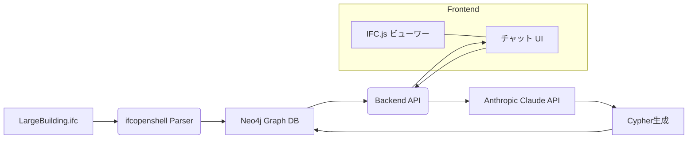

# BIM× 生成 AI デモシステム 用件定義 (claude.md)

## 目次

1. [目的](#1-目的)
2. [範囲](#2-範囲)
3. [システム概要](#3-システム概要)
4. [機能要件](#4-機能要件)
5. [非機能要件](#5-非機能要件)
6. [アーキテクチャ](#6-アーキテクチャ)
7. [画面／UI 要件](#7-画面ui要件)
8. [API 要件](#8-api-要件)
9. [技術スタック](#9-技術スタック)
10. [運用・デプロイ要件](#10-運用デプロイ要件)
11. [スケジュール](#11-スケジュール)

---

## 1. 目的

- 鹿島建設向けデモとして、IFC モデルをブラウザ上で可視化し、自然言語チャット形式で問い合わせ可能なプロトタイプを短期間で提供すること。
- IFC ファイル単体を利用し、業務上よく使う「階数」「部屋数」「属性情報」の取得を体験的に見せる。

## 2. 範囲

- **対象ファイル**:
  - `LargeBuilding.ifc`（サンプル IFC）
  - GitHub リポジトリ: https://github.com/andrewisen/bim-whale-ifc-samples/blob/main/LargeBuilding/IFC/LargeBuilding.ifc
- **機能**: IFC モデルのアップロード、可視化ビューワー、チャット UI、Cypher クエリ生成・実行、結果返却
- **期間**: 2025 年 7 月 22 日（デモ当日 10:00）まで

## 3. システム概要

## 4. 機能要件 機能要件

### 4.1 ファイルアップロード

- ユーザーはブラウザから IFC ファイルをアップロードできる。
- アップロード後、ユニークなセッション ID を発行し、解析ジョブと結びつける。

### 4.2 IFC モデル解析 & データ登録

- ifcopenshell を用いて IFC ファイルを解析。
- `IfcBuilding`, `IfcBuildingStorey`, `IfcSpace`, `IfcWindow`, `IfcDoor` など主要要素を抽出。
- Neo4j に要素をノード、関連をリレーションシップとして登録。

### 4.3 3D ビューワー

- アップロードされた IFC ファイルをリアルタイムに読み込み、IFC.js（three.js + WebAssembly）を利用してブラウザ上で IFC モデルをレンダリング。
- 回転・ズーム・パンなど基本操作をサポート。

### 4.4 チャット UI チャット UI

- 入力欄に自然言語で質問を入力。
- 送信ボタンでバックエンドにリクエスト。
- LLM(CLAUDE API) による Cypher 生成 → Neo4j 実行 → 結果をチャット形式で表示。
- 質問履歴と回答履歴を一覧表示。

### 4.5 クエリ例

- "何階建てですか？" → `MATCH (b:IfcBuilding) RETURN b...`
- "2 階の部屋数は？" → `MATCH (s:IfcStorey {level:2})-[:CONTAINS]->(sp:IfcSpace) RETURN count(sp)`

## 5. 非機能要件

- **パフォーマンス**: IFC ファイルアップロードからビューワー表示まで 5 秒以内。
- **信頼性**: セッション単位で解析データを保持し、同一セッション内で再利用可能。
- **拡張性**: 他の IFC ファイルにも同様に対応できる設計。
- **セキュリティ**: アップロードファイルはセッション終了時に削除。外部アクセス制限。

## 6. アーキテクチャ

- **Frontend**: React (TypeScript) + IFC.js
- **Backend**: FastAPI (Python)
- **AI Service**: Anthropic Claude API
- **DB**: Neo4j (Bolt)
- **インフラ**: Docker Compose

## 7. 画面／UI 要件

| 画面             | 説明                                         |
| ---------------- | -------------------------------------------- |
| アップロード画面 | ファイル選択・アップロードボタン             |
| ビューワー画面   | 3D モデル表示、操作コントロール              |
| チャット画面     | 入力欄、送信ボタン、問い合わせ履歴リスト表示 |

## 8. API 要件

### POST /upload_ifc

- **Request**: Multipart/FormData (file)
- **Response**: `{ session_id: string }`

### POST /chat

- **Request**: `{ session_id: string, question: string }`
- **Response**: `{ cypher: string, result: any[] }`

## 9. 技術スタック

- Python 3.9+
- FastAPI
- Uvicorn
- ifcopenshell
- neo4j-driver
- React 18 + TypeScript
- web-ifc-three (IFC.js)
- Anthropic Claude API
- Docker, Docker Compose

## 10. 運用・デプロイ要件

- **開発環境**: Docker Compose で Frontend/Backend/Neo4j を立ち上げ。
- **環境変数**: `CLAUDE_API_KEY`, `NEO4J_URI`, `NEO4J_AUTH` を設定。
- **ログ**: アップロード・クエリ履歴をコンソール出力。

## 11. スケジュール

| 日付             | タスク                                              |
| ---------------- | --------------------------------------------------- |
| 7 月 21 日夕     | 環境構築、基本機能（アップロード～ Neo4j 登録）実装 |
| 7 月 21 日夜     | ビューワー／チャット UI 統合                        |
| 7 月 22 日朝     | プロンプト調整・最終テスト                          |
| 7 月 22 日 10:00 | 鹿島建設向けデモ実施                                |

---

_以上_
